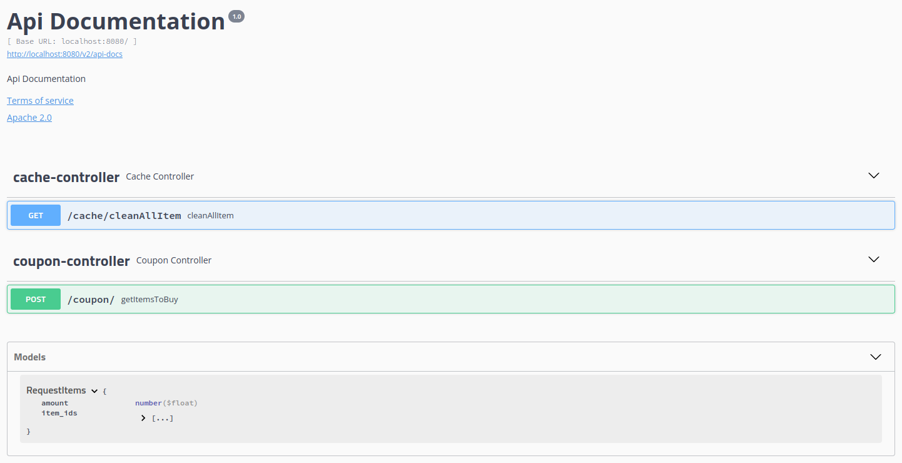
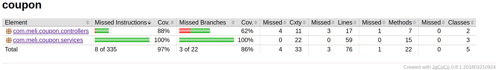
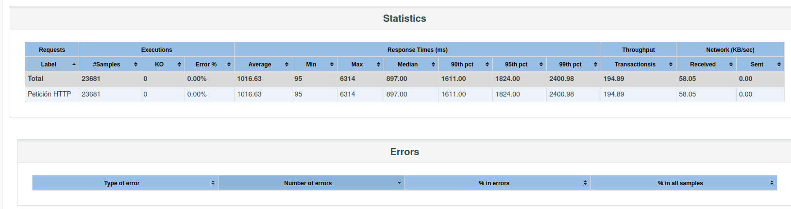
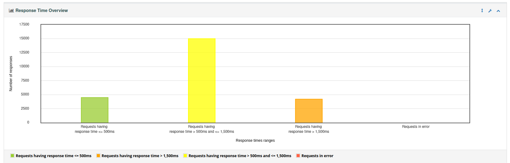
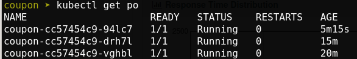

# Coupon

Esto servicio cuenta con un  API que dado una lista de item_id de mercado libre y el monto total del cupon que otorga la organizacion, retorna la lista de items que maximiza el total gastado sin excederlo.

## Instalacion usando Docker
Puede descargar el codigo fuente desde el repositorio de GitHub con el siguiente comando:
> git clone https://github.com/sbas23/coupon.git

En la raiz del proyecto existe un archivo DockerFile con el siguiente contenido:

	FROM java:8

	ENV TZ=America/Bogota
	ENV JAR=coupon-1.0.0.jar
	ENV PORT=8080
	ENV PROFILE=development

	RUN ln -snf /usr/share/zoneinfo/$TZ /etc/localtime && echo $TZ > /etc/timezone

	CMD ["WORKDIR", "/home/app/"]
	COPY target/$JAR /home/app/

	CMD ["WORKDIR", "/config/"]
	COPY src/main/resources/* /config/

	CMD chmod -R 777
	CMD java -Djava.security.egd=file:/dev/urandom -jar /home/app/$JAR --spring.profiles.active=$PROFILE

	EXPOSE $PORT

Para construir el contenedor ejecutar los siguientes comandos:
>docker build  -t "coupon" .

>docker run -d --name coupon  -p 8080:8080 coupon

**NOTA:** se requiere tener instalado docker para poder ejecutar los comandos anteriormente mencionados.

Tambien se encuentra una imagen disponible de la version 1.0.0 en el repositorio de DockerHub que puede descargar y ejecutar con las siguientes instrucciones:

>docker login

>docker pull sbas23/coupon:v1

>docker run -d --name coupon  -p 8080:8080 sbas23/coupon:v1

## Despliegue en Kubernetes

Para desplegar el componente en un ambiente administrado por kubernetes se dispone de un archivo deployment.yaml en la raiz del proyecto con el siguiente contenido:

	apiVersion: apps/v1
	kind: Deployment
	metadata:
	  name: coupon
	  namespace: default
	  labels:
	    app: app-service 
	    version: 1.0.0
	spec:
	  replicas: 1
	  selector:
	    matchLabels:
	      app: coupon
	  template:
	    metadata:
	      labels:
		app: coupon
	    spec:
	      containers:
	      - name: coupon
		image: gcr.io/c0a6583d3e5d/coupon:1.0.0
		imagePullPolicy: Always
		ports:
		- containerPort: 8080
		  protocol: TCP
		resources:
		  requests:
		    cpu: 100m
		    memory: 1024Mi
		  limits:
		    cpu: 200m
		    memory: 2048Mi
		 
	---
	kind: Service
	apiVersion: v1
	metadata:
	  name: coupon
	  namespace: default
	  labels:
	    app: app-service 
	spec:
	  type: LoadBalancer
	  selector:
	    app: coupon 
	  ports:
	    - port: 8080
	      targetPort: 8080
	      protocol: TCP
	     
	---
	apiVersion: autoscaling/v2beta2
	kind: HorizontalPodAutoscaler
	metadata:
	  name: coupon
	  namespace: default
	spec:
	  scaleTargetRef:
	    apiVersion: apps/v1
	    kind: Deployment
	    name:  coupon
	  minReplicas: 1
	  maxReplicas: 10
	  metrics:
	  - type: Resource
	    resource:
	      name: memory
	      target:
		type: Utilization
		averageUtilization: 70
	  - type: Resource
	    resource:
	      name: cpu
	      target:
		type: Utilization
		averageUtilization: 70
	---

Este yaml cuenta con la configuracion necesaria para desplegar un POD con el codigo fuente que debe estar publicado en un container registry (para este caso se uso el de google), un service y una politica de autoescalamiento que permitira que el componente escale de manera automatiza segun el trafico lo demande.

Para ejecutar este deployment se aplicaron las siguientes instrucciones:

Subir la imagen:
>docker tag coupon gcr.io/c0a6583d3e5d/coupon:1.0.0

>docker push gcr.io/c0a6583d3e5d/coupon:1.0.0

Desplegar el componente:
>gcloud config set project c0a6583d3e5d

>gcloud container clusters get-credentials  autopilot-cluster-1 --zone us-central1
   
>kubectl apply -f deployment.yaml

**Nota:** se requiere contar con el SDK de Google Cloud

## Funcionamiento del servicio:

El servicio cuenta con dos API una para realizar la consulta de los Item que se puenden comprar con un saldo disponible en un cupon, y otra para la limpieza de cache del almacenamiento de consultas recurrentes por item id (Este cache se limpia autromaticamente cada hora este tiempo es configurable desde un yml de propiedades). Las mismas APIs estas documentadas en el siguiente enlace:

> http://{IP}:{Puerto}/swagger-ui.html

Para realizar la consulta de los items a comprar consumir la siguiente URL y el siguiente contrato tipo JSON:

> URL: http://{IP}:[PORT}/coupon/

Ejemplo JSON:

	{
	    "item_ids":["MLA925840874","MLA925840875","MLA925840876","MLA925840877","MLA925840878","MLA925840879","MLA925840880","MLA925840881"],
	    "amount":20000
	}
	
Con lo anterior temdra una respuesta:

	{
	    "total": 5110.0,
	    "item_ids": [
		"MLA925840879",
		"MLA925840880",
		"MLA925840877",
		"MLA925840876",
		"MLA925840875"
	    ]
	}
	
## Monitoreo:

El srevicio cuenta con un log en formato JSON con un identificador unico spanId que le ayudara a realizar seguimiento de cada transaccion como se muestra a continuacion:

	{
	  "timestamp": "2021-12-08 11:04:27,941",
	  "level": "INFO",
	  "class": "c.m.c.controllers.CouponController",
	  "method": "getItemsToBuy",
	  "line": "29",
	  "marker": "",
	  "message": "Start request: RequestItems(itemIds=[MLA925840874], amount=20000.0)",
	  "Exception": "",
	  "spanId": "fb665174-342d-4f9a-9413-f451dac838d2"
	}
	{
	  "timestamp": "2021-12-08 11:04:27,942",
	  "level": "INFO",
	  "class": "c.m.c.controllers.CouponController",
	  "method": "getItemsToBuy",
	  "line": "34",
	  "marker": "",
	  "message": "End request, response: ResponseItems(itemIds=[MLA925840874], total=0.0)",
	  "Exception": "",
	  "spanId": "fb665174-342d-4f9a-9413-f451dac838d2"
	}
	
Este log esta en la ruta: logs/coupn.log

**Nota:**  para consolas linux se recomiendainstalar la herramienta jq la cual realiza formateo de archivos json o usar un concentrador de logs como fluentd para el seguimiento de transacciones apartir de logs.

El servicio cuenta con una interfaz que muestra metricas:

> http://{IP}:{PORT}/actuator

## Coverage:

Para la medicion de la cobertura del codigo por pruebas unitarias se uso el siguiente pluging de maven:

			<plugin>
				<groupId>org.jacoco</groupId>
				<artifactId>jacoco-maven-plugin</artifactId>
				<version>0.8.1</version>
				<executions>
					<execution>
						<goals>
							<goal>prepare-agent</goal>
						</goals>
					</execution>
					<execution>
						<id>report</id>
						<phase>package</phase>
						<goals>
							<goal>report</goal>
						</goals>
					</execution>
				</executions>
				<configuration>
				    <excludes>
				        <exclude>com/meli/coupon/config/*.class</exclude>
				        <exclude>com/meli/coupon/cache/*.class</exclude>
				        <exclude>com/meli/coupon/models/*.class</exclude>
				        <exclude>com/meli/coupon/CouponApplication.class</exclude>
				    </excludes>
				</configuration>
			</plugin>
			
En este se excluyen algunas rutas de configuracion a las que no se les realizo pruebas unitarias.

## Puebra de carga
Se realiza prueba de carga usando jmeter la configuracion propuesta se encuentra en /jmeter asi como los resultados formateados en un html usando la herramienta. se envian 23681 peticiones en 120 segundos y se obtiene el siguiente resultado:

De lo anterior se concluye:

* No se presentaron errores en la peticiones
* La mayoria de las peticiones se respondieron en menos de 1500 ms lo cual es alto pero para solventarlo kubernetes automaticamente subio el numero de pobs a 3 como se aprecia en la ultima imagen.

